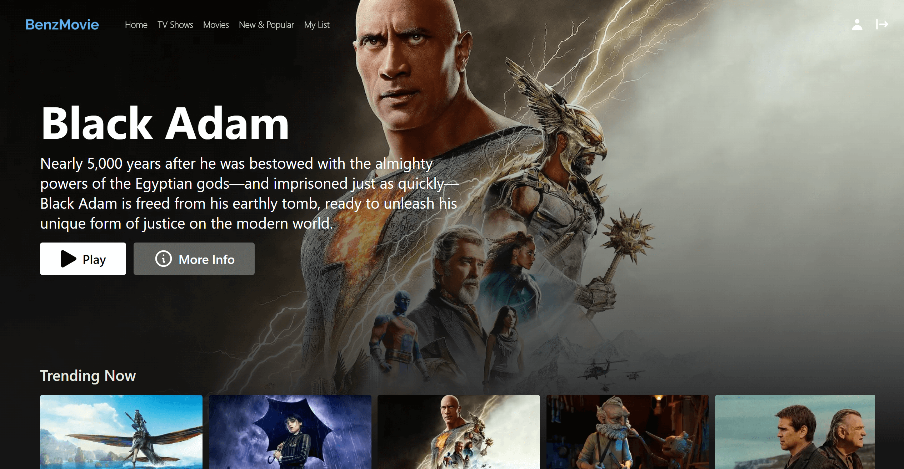

# Benz Movie

A Netflix clone project built with Typescript, Next.js and Firebase Authentication.

[View Live Site]()

## Features

- Show up to date trending movies from TMDB API by SSR with Next.js.
- Users can sign in with email/password to use the app, the authentication process are implemented with Firebase.
- Movie details and trailer are also available.

## Preview

## Tech stack

- [Typescript](https://www.typescriptlang.org/)
- [Next.js](https://nextjs.org/)
- [Firebase](https://firebase.google.com/)
- [Recoil](https://recoiljs.org/)
- [Material UI](https://mui.com/)
- [Tailwind CSS](https://tailwindcss.com/)

## Show your support

Give a ⭐️ if you like this project!

## License

[MIT](LICENSE)
